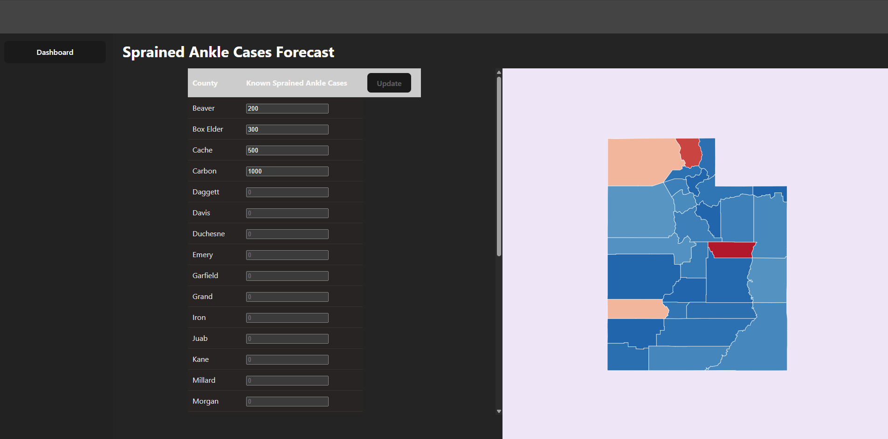

## What is this?

This is a prototype application with the goal of giving the author a good refresher on having a reactjs typescript application talking to a python flask REST API. I originally thought about doing the generic todo app to demonstrate capability on all CRUD operations, but I decided to take a risk by going the route of building a prototype that would be closer to a real life problem such as how to display forecasted Utah County sprained ankle data on an interactable map. Please refer to \_docs/SPIKE_DASHBOARD.md for details on the dashboard research and a solution that came from it.

#### Prototype Demo

The rest of this README.md file will go over how to run this application locally. Now why did I decide to combine both frontend and backend projects into one repo? Since this is designed to be only a prototype and not meant to go live on a production environment, I figured it would be simpler for anyone visiting this repo to clone the repo and run it. In a normal, professional environment, I would split the frontend and backend into their own repositories. (Imagine the coordination a larger team would have to pull to make a repo that has both frontend and backend!)

## JavaScript

Version: 24.11.1

This is using vite, reactjs, and typescript.
Commands are on package.json. Please make sure to run `npm install` to build dependencies.

- `npm run dev`: Runs develop environment
- `npm run build`: Bundles application that is suitable to be served over a static hosting service
- `npm run preview`: Starts local web server that serves built solution from `./dist` for previewing
- `npm run test`: Uses Jest and testing-library/react to run unit tests

## Python

Version: 3.14.0
This is a flask application that uses postgres and docker for local development.

This is using taskipy for running local commands.
Please refer to the backend/pyproject.toml file and look for the section called tool.taskipy.tasks to see which commands are available to use.

### Minimum requirements to run python flask locally

Have docker installed on your machine
Configure root level of project's .env file to configure environmental variables that will be used in docker-compose.yml.

Once docker is running, all you need to do is run `docker-compose build` then `docker-compose up` to run the application.
This application is using Flask-Migrate and SQLAlchemy. There are some options for using migrations.

First option, running flask db migration commands in the docker instance.

1. Run `docker ps` to get the name of the container (Refer to docker-compose.yml).
2. Run `docker exec -it` [Name of Container] `bash` to connect to container.
3. Run `flask db upgrade` to apply migrate or `flask db downgrade` to undo migration.

Second option, running flask db migration commands on host machine.

1. Make sure to use python 3.14.0 for the virtual environment
2. Setup .venv https://packaging.python.org/en/latest/guides/installing-using-pip-and-virtual-environments/
3. Once in virtual environment, run `flask db upgrade` to apply migrate or `flask db downgrade` to undo migration.
